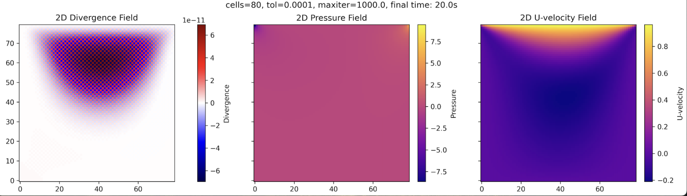
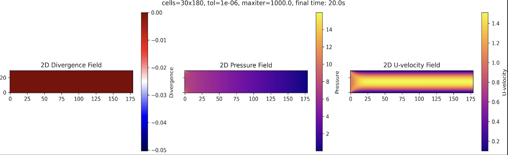
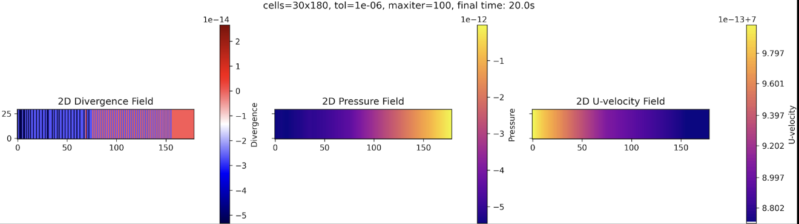

# Incompressible Navier Stokes solver

This repository contains a solver for the incompressible Navier-Stokes equations using Chorin's projection method and a predictor-corrector algorithm. The momentum equations are solved without the pressure term, and the pressure is computed using the Poisson equation derived from taking the divergence of the continuity equation and introducing it into the momentum equations. Finally, the velocity fields are corrected by applying the pressure term. The repository includes two benchmark simulations commonly used in fluid dynamics and computational fluid dynamics (CFD) research: cavity lid-driven flow and channel flow. Open field is a preamble to set a wind farm. Each simulation is set up within a specific domain with appropriate boundary conditions.
---

## `cavity.py` - Cavity Lid-Driven Flow Benchmark

This repository includes a benchmark simulation of lid-driven cavity flow within a square domain. This setup is commonly used to test numerical solvers for incompressible flows.

### Domain Setup
- **Geometry**: Square domain with four walls.

### Boundary Conditions
- **Upper Wall**: Moves at a constant velocity, generating flow within the cavity.
- **Other Walls**: Static, enforcing a confined flow environment.

#### Velocity
- **Upper Wall**: Dirichlet condition with constant velocity.
- **Side and Bottom Walls**: Dirichlet non-slip condition, creating a stationary boundary.

#### Pressure
- **All Walls**: Neumann zero-gradient, suitable for incompressible flow constraints.

---

## `channel.py` - Channel Flow Benchmark – Pressure-Driven Flow in a Pipe

This code contains a benchmark simulation of pressure-driven flow through a rectangular domain, modeling fluid flow in a pipe with static upper and lower walls.

### Domain Setup
- **Geometry**: Rectangular domain with static upper and lower walls.

### Boundaries
- **Left boundary**: Inlet (Dirichlet condition for pressure).
- **Right boundary**: Outlet (Dirichlet condition for pressure).

### Boundary Conditions
#### Inlet and Outlet
- **Pressure**: Dirichlet conditions to drive the flow.
- **Velocity**: Zero-gradient to allow smooth entry and exit of flow.

#### Upper and Lower Walls
- **Pressure**: Zero-gradient.
- **Velocity**: No-slip condition, enforcing a stationary boundary.

---

## `openfield.py` - Open Field Benchmark – Pre-Turbine Wind Farm Simulation

This repository includes a pre-turbine wind farm simulation, setting up an open field with an imposed inlet velocity. This setup is suitable for initializing flow conditions before introducing turbines.

### Domain Setup
- **Geometry**: Rectangular domain representing an open field.
- **Purpose**: Establishes boundary conditions to simulate inflow dynamics across the open field, providing a controlled environment for subsequent turbine interactions.

### Boundary Conditions
#### Pressure
- **Outlet**: Dirichlet condition with zero pressure.
- **All Other Boundaries**: Zero-gradient to maintain smooth flow characteristics.

#### Velocity
- **Inlet**: Dirichlet condition with specified inlet velocity.
- **Other Boundaries**: Zero-gradient to allow unrestricted flow development.
x

        
